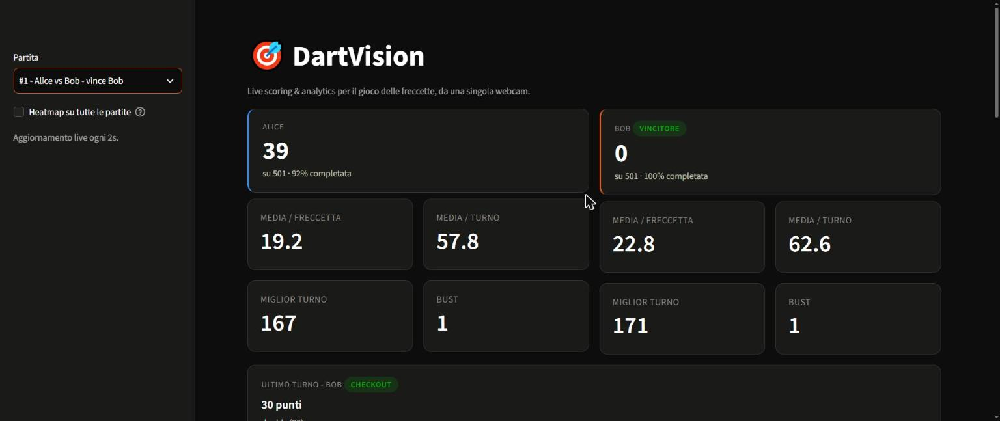
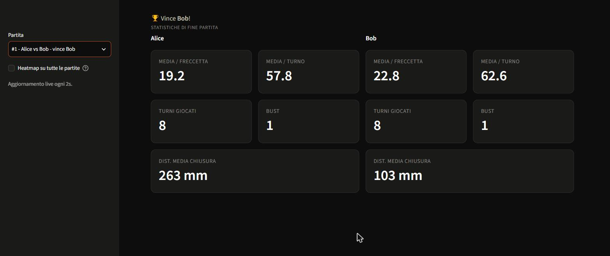
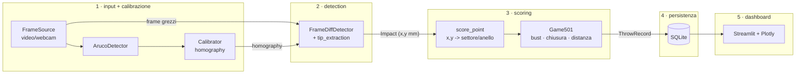

# 🎯 DartVision

Sistema di computer vision per il punteggio automatico a freccette (501), da una
**singola webcam**, con calibrazione **automatica** tramite marker ArUco e una
dashboard live per punteggio, storico e heatmap degli impatti.

Progetto di portfolio pensato per essere letto quanto per essere eseguito: ogni
scelta progettuale è motivata più sotto, non solo implementata.



## Indice

- [Cosa fa](#cosa-fa)
- [Architettura](#architettura)
- [Perché queste scelte progettuali](#perché-queste-scelte-progettuali)
- [Struttura del repository](#struttura-del-repository)
- [Setup](#setup)
- [Configurazione fisica del bersaglio](#configurazione-fisica-del-bersaglio)
- [Stampare e posizionare i marker ArUco](#stampare-e-posizionare-i-marker-aruco)
- [Utilizzo](#utilizzo)
- [Test](#test)
- [Limiti noti](#limiti-noti)
- [Roadmap](#roadmap)

## Cosa fa

1. Legge un video (file mp4 oggi, webcam come estensione futura — vedi
   [Roadmap](#roadmap)).
2. Rileva 4+ marker ArUco posizionati attorno al bersaglio e calcola
   l'homography che raddrizza la vista in un cerchio perfetto — **ricalcolata
   ad ogni frame**, quindi robusta a una webcam che cambia posizione tra una
   sessione e l'altra.
3. Rileva quando una nuova freccetta compare (differenza tra frame) e ne
   isola la punta, convertendola in coordinate sul piano raddrizzato.
4. Converte la coordinata in settore/anello/punteggio e applica le regole
   della modalità 501 (bust, chiusura su doppio o bullseye interno,
   distanza dal target di chiusura).
5. Salva ogni freccetta in SQLite.
6. Mostra tutto in una dashboard Streamlit live: punteggio corrente, medie,
   residuo, storico, heatmap interattiva sul bersaglio, statistiche di fine
   partita.



## Architettura

Il sistema è stato costruito **un livello alla volta, dal segnale verso
l'alto**, verificando ciascuno prima di passare al successivo — lo stesso
ordine in cui va letto:



`pipeline.runner` è l'**unico** modulo che conosce tutti i livelli: li
orchestra, ma nessuno di essi conosce gli altri. In pratica:

| Modulo | Responsabilità | Non sa nulla di |
|---|---|---|
| `input` | Fornire frame, da un file o (in futuro) una webcam | calibrazione, detection, scoring |
| `calibration` | Rilevare i marker, calcolare/ricalcolare l'homography | detection, scoring, persistenza |
| `detection` | Trovare il punto d'impatto sul piano raddrizzato | numerazione dei settori, regole 501 |
| `scoring` | (x,y) → settore/anello/punteggio; regole 501 | OpenCV, SQLite, Streamlit |
| `persistence` | Salvare/rileggere partite e tiri | come un punteggio viene calcolato |
| `pipeline` | Collegare i livelli sopra in un ciclo | — (l'unico che li conosce tutti) |
| `dashboard` | Visualizzare cosa c'è nel database | CV, detection — legge **solo** dal DB |

Questa separazione non è decorativa: è il motivo per cui, ad esempio, ho
potuto costruire e collaudare a fondo `scoring` con dati completamente finti
(nessuna dipendenza da OpenCV), e perché la dashboard non deve cambiare di
una riga quando in futuro cambierà l'algoritmo di detection.

## Perché queste scelte progettuali

**Calibrazione via ArUco, ricalcolata ogni frame.** Il vincolo di partenza è
un setup mobile: la webcam può spostarsi tra una sessione e l'altra. Una
calibrazione salvata su disco si romperebbe al primo spostamento. Rilevando
i marker e ricalcolando l'homography ad ogni frame, il sistema si autoregola
sempre — il prezzo è dover gestire con cura il caso "marker insufficienti"
(vedi sotto), non un crash.

**Fallback esplicito, mai un'eccezione.** `Calibrator.calibrate()` ritorna
sempre un `CalibrationResult` con `success` e un messaggio diagnostico,
anche quando i marker rilevati sono troppo pochi. Il chiamante scarta il
frame e continua: in un flusso video continuo, un singolo frame mal
illuminato non deve mai interrompere la sessione.

**Detection dietro un'interfaccia astratta (`ImpactDetector`).** L'algoritmo
di detection è la parte più delicata e più probabile da rifare (un domani
con un modello ML). Tenerlo dietro un'interfaccia con firma fissa
(due frame + homography → `Impact` sul piano o `None`) significa poter
sostituire `FrameDiffDetector` senza toccare scoring, persistenza o
dashboard — e poterlo testare con frame finti, senza hardware.

**Diff sui frame grezzi, non su quelli raddrizzati.** Ri-raddrizzare ogni
frame con `warpPerspective` prima di confrontarlo col precedente introduce
un micro-jitter: l'homography viene ricalcolata ogni frame dai marker
rilevati, con un minimo di rumore di sub-pixel, per cui l'intera immagine
raddrizzata "vibra" leggermente anche a telecamera ferma — abbastanza da
generare falsi positivi nella differenza tra frame. Si confrontano invece i
frame della camera così come sono (stabili, se la camera non si muove), e
solo i contorni candidati che superano la prima soglia grezza vengono
proiettati sul piano raddrizzato — dove le soglie di area (config) restano
espresse in unità fisiche stabili, indipendenti da quanto la webcam sia
vicina o lontana dal bersaglio.

**La punta è il punto più vicino al centro.** Quando una freccetta si
conficca, la regione rilevata dal frame-diff include punta, fusto e alette.
L'euristica adottata — indicata dalle specifiche del progetto — è scegliere
il punto della sagoma rilevata più vicino al centro del bersaglio: fusto e
alette sporgono verso l'esterno, la punta è l'estremo più "interno". È
isolata in una funzione a sé (`tip_extraction.select_tip_point`) proprio
per poter essere sostituita con un'euristica diversa senza toccare il resto
del detector.

**Il bust è un concetto di turno, non di singola freccetta.** Punto
facile da sbagliare: se la terza freccetta di un turno manda in bust, anche
i punti delle prime due — validi al momento del lancio — vengono annullati,
e il residuo torna a quello di inizio turno. `Game501` lo implementa
esplicitamente, con un test dedicato proprio per questo caso.

**Ordine di costruzione bottom-up.** Ogni livello è stato verificato prima
di costruire il successivo: la calibrazione su un video sintetico con
marker veri (Livello 1) prima ancora di scrivere una riga di detection; la
detection verificata con blob disegnati a mano prima di collegarla allo
scoring; lo scoring testato con coordinate pure, senza nessuna dipendenza
da OpenCV, prima di collegarlo alla persistenza. Questo ha fatto emergere
presto i problemi (es. la geometria dei marker mal dimensionata nel
Livello 1, o la sensibilità del frame-diff a freccette molto ravvicinate —
vedi [Limiti noti](#limiti-noti)) invece che a integrazione ultimata.

## Struttura del repository

```
config/
  board_config.yaml          # UNICA fonte di geometria fisica: raggi anelli,
                              # posizione marker, soglie di detection
docs/
  images/                     # screenshot per questo README
scripts/
  generate_aruco_markers.py   # genera i PNG dei marker da stampare
  generate_synthetic_video.py # video mp4 sintetico per sviluppo/test (dev tool)
  process_video.py            # pipeline completa: video -> DB
  seed_demo_data.py           # popola il DB con dati demo (bypassa la CV, per la dashboard)
  run_on_video.py             # solo Livello 1: diagnostica di calibrazione
  run_dashboard.py            # avvia la dashboard Streamlit
src/dartvision/
  config.py                   # loader tipizzato di board_config.yaml
  input/                      # Livello 1a: FrameSource (video oggi, webcam poi)
  calibration/                # Livello 1b: ArucoDetector, Calibrator/homography
  detection/                  # Livello 2: ImpactDetector, FrameDiffDetector, tip_extraction
  scoring/                    # Livello 3: geometria polare, punteggio, regole 501
  persistence/                # Livello 4: modelli, schema SQLite, repository
  pipeline/                   # orchestratore: unisce i livelli 1-4
  analytics.py                 # statistiche di fine partita (logica pura)
  dashboard/                   # Livello 5: app Streamlit, figura Plotly, componenti
tests/                         # 83 test, pytest
```

## Setup

Richiede Python 3.11+ e [uv](https://docs.astral.sh/uv/).

```bash
uv sync            # installa tutte le dipendenze in .venv
uv run pytest -q   # verifica che tutto funzioni: 83 test dovrebbero passare
```

Nessun'altra configurazione è necessaria per esplorare il progetto con i
dati dimostrativi già inclusi.

## Configurazione fisica del bersaglio

Tutta la geometria fisica vive in `config/board_config.yaml`, mai nel
codice: raggi degli anelli, ordine e offset dei settori, dizionario ArUco,
posizione di ciascun marker rispetto al centro del bersaglio, soglie di
detection. Per adattare il sistema a un bersaglio o setup diverso si
modifica solo questo file. `dartvision.config.load_config()` lo valida
(raggi crescenti, nessun settore duplicato, marker sufficienti, geometria
coerente col piano raddrizzato) e fallisce subito con un messaggio chiaro
se qualcosa non torna.

## Stampare e posizionare i marker ArUco

```bash
uv run python scripts/generate_aruco_markers.py
```

Genera in `docs/markers/` un PNG per marker, dimensionato in DPI per
ottenere esattamente il lato fisico configurato (`marker_length_mm`).
Dopo averli stampati e posizionati attorno al bersaglio:

1. Misura la distanza reale del **centro** di ciascun marker dal centro del
   bersaglio (bullseye).
2. Aggiorna i campi `x_mm`/`y_mm` di quel marker in `board_config.yaml`.
3. Verifica con `scripts/run_on_video.py` (sotto) che la calibrazione
   raddrizzi il bersaglio in un cerchio corretto.

## Utilizzo

### Elaborare un video registrato

```bash
uv run python scripts/process_video.py --video path/al/video.mp4
```

Esegue l'intera pipeline (calibrazione → detection → scoring →
persistenza) e salva la partita in `data/dartvision.db`, stampando un
riepilogo turno per turno.

### Dashboard

```bash
uv run python scripts/run_dashboard.py
```

Apre la dashboard su `http://localhost:8501`, che legge live da
`data/dartvision.db` (aggiornamento automatico ogni 2 secondi via
`st.fragment`, senza ricaricare l'intera pagina).

Se il database è vuoto, popolalo con dati dimostrativi (bypassa la
computer vision, usa direttamente i livelli di scoring/persistenza già
testati):

```bash
uv run python scripts/seed_demo_data.py                 # una partita completa
uv run python scripts/seed_demo_data.py --max-turns 3    # una partita "in corso"
```

### Solo calibrazione (diagnostica Livello 1)

```bash
uv run python scripts/run_on_video.py --video path/al/video.mp4 \
    --output-rectified out_rectified.mp4 --output-annotated out_annotated.mp4
```

Utile per isolare problemi di calibrazione (marker non rilevati, homography
instabile) senza il resto della pipeline.

### Video sintetico (per sviluppo, senza hardware)

```bash
uv run python scripts/generate_synthetic_video.py --dart=0,0 --dart=20,-140
```

Genera un mp4 con bersaglio, marker e freccette finte proiettati con
un'unica homography plausibile, più un `.ground_truth.json` con le
coordinate vere — usato per sviluppare e validare i Livelli 1-2 prima di
avere un setup fisico.

## Test

```bash
uv run pytest -q
```

83 test. Priorità data alla logica pura (geometria, punteggio, regole 501,
distanza di chiusura, statistiche): non richiedono OpenCV né un database,
girano in meno di 2 secondi. Calibrazione, detection, persistenza e
pipeline hanno invece test con dati sintetici (marker finti, frame
disegnati a mano, database temporanei) — nessun test richiede un video o
un DB reali.

## Limiti noti

**Il frame-diff fatica con freccette molto ravvicinate.** Nel costruire i
dati dimostrativi ho verificato che quando due impatti atterrano a pochi
millimetri l'uno dall'altro in tempi ravvicinati, la compressione video
(mp4/H.264) introduce artefatti che deformano la regione "nuova" rilevata
in una mezzaluna invece che in un cerchio pulito, confondendo l'euristica
della punta. È il motivo per cui `scripts/seed_demo_data.py` genera i dati
dimostrativi della dashboard direttamente dai Livelli 3-4 (già validati),
mentre `process_video.py` resta il percorso reale via computer vision —
accurato quando gli impatti sono ragionevolmente separati, come verificato
nei test di integrazione. Un miglioramento naturale: un modello di sfondo
multi-frame (es. media mobile o MOG2) al posto del diff tra due soli frame
consecutivi.

**Nessun rilevamento di fine turno anticipata.** Un turno viene chiuso al
terzo impatto rilevato, o alla fine del video se ne restano meno di tre in
sospeso. Per un file registrato questo non è un problema pratico (i turni
sono quasi sempre completi), ma su uno stream live continuo non c'è ancora
modo di riconoscere che un turno è finito dopo 1-2 freccette (es. un
checkout precoce) senza aspettare la terza. Punto naturale in cui la
futura estensione a webcam live dovrà aggiungere un'euristica di confine
turno (timeout di inattività, o la mano che entra a ritirare le
freccette).

## Roadmap

- **Webcam live**: l'interfaccia `FrameSource` è già pensata per questo —
  serve solo una `WebcamSource` che avvolga `cv2.VideoCapture(0)`, nessun
  altro modulo cambia. Rimandato finché non c'è un setup fisico (marker
  stampati, bersaglio, webcam) su cui validare le soglie di detection con
  dati reali, non sintetici.
- Euristica di confine turno per stream continui (vedi sopra).
- Modello di sfondo multi-frame per la detection, per migliorare la
  robustezza a impatti ravvicinati e a mani/ombre in movimento.
