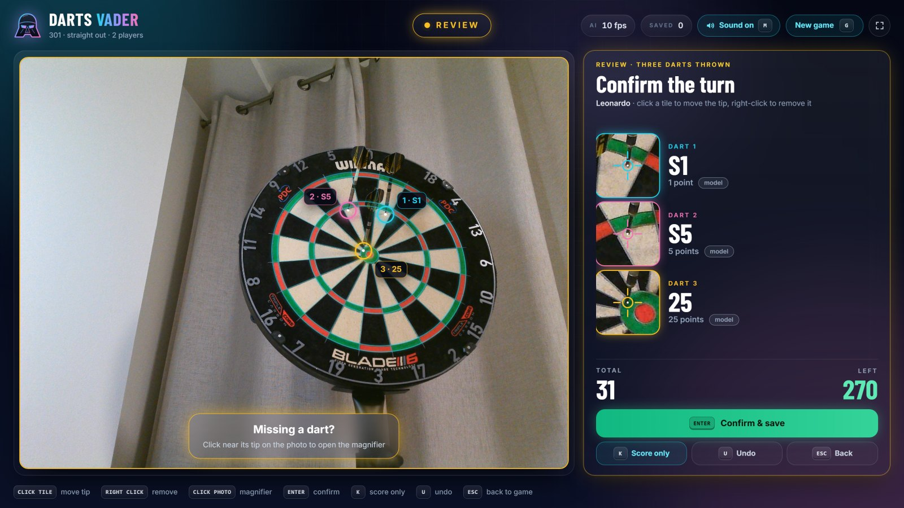
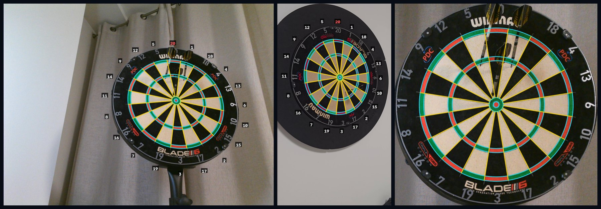
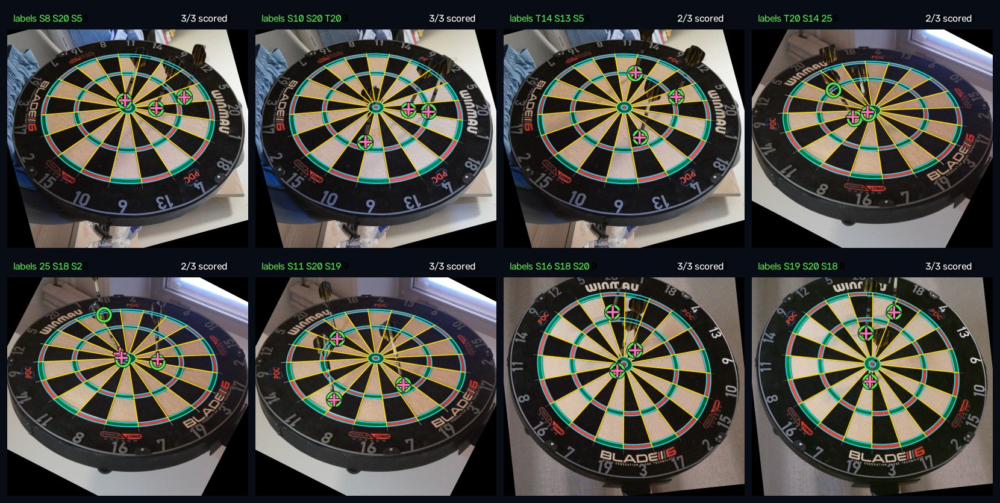
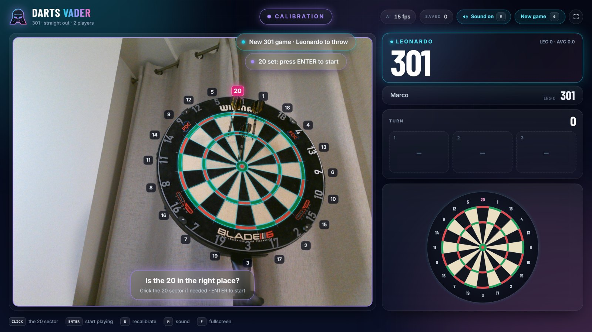
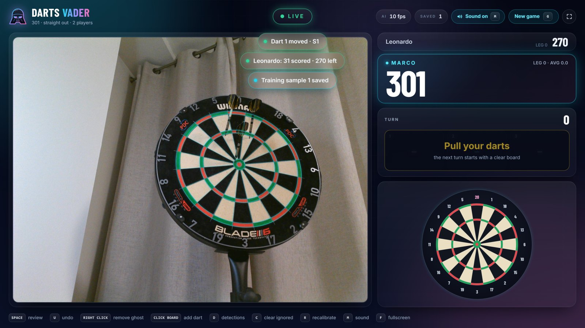
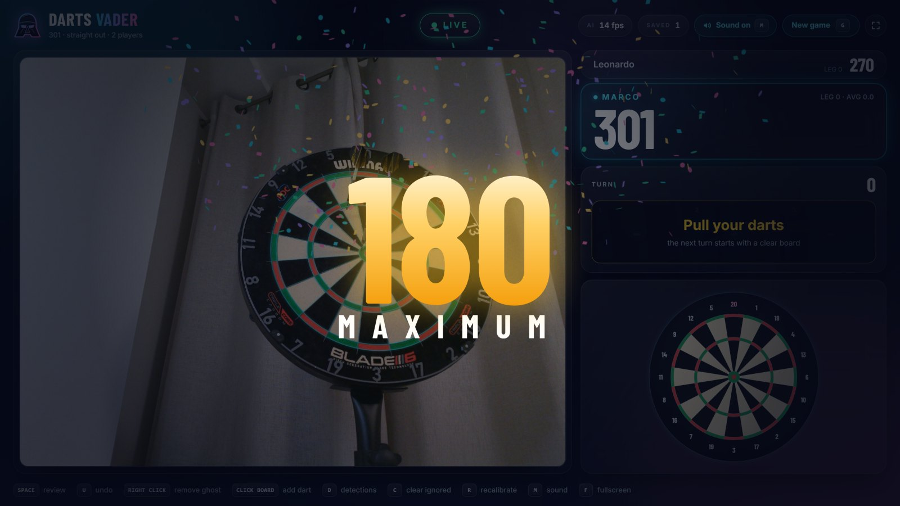
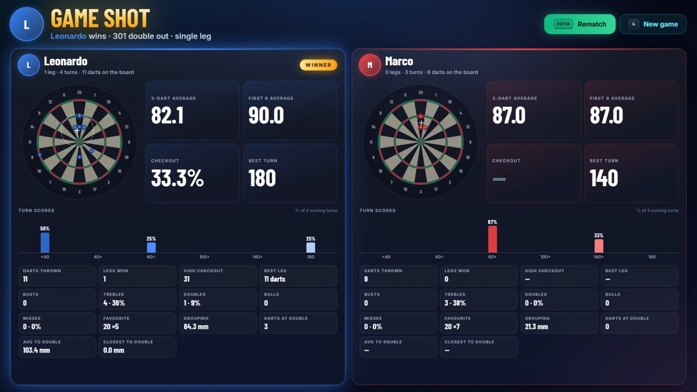

# DARTS VADER

Automatic darts scoring from a single webcam.

DARTS VADER locks onto a standard dartboard from almost any viewing angle, finds the dart tips
with a small neural network and runs a live x01 game in a fullscreen web app. Every turn is
reviewed on a still photo before it counts, and every confirmed turn becomes a new training
example for the tip model.



## Features

- **Marker-free board detection.** A full perspective homography is fitted directly to the rings
  and sector wires, with per-board calibration of the wire radii and frame-to-frame tracking.
- **Learned dart-tip detection.** TipNet, a CenterNet-style ResNet-18 heatmap model, runs on an
  orientation-normalised crop of the board. It is trained on the public DeepDarts dataset plus
  your own webcam photos.
- **Live x01 games.** 101 to 1001, straight or double out, busts, checkout suggestions,
  three-dart averages, up to six players.
- **Double-out practice.** In double-out games the mini board highlights the double that would
  finish the leg and shows how many millimetres each dart landed from it.
- **Players and matches.** Player photos (uploaded or taken with any camera), matches played as
  a single leg or first to 2, 3 or 5 legs.
- **Match statistics.** When the match ends, the winning animation morphs into a statistics
  screen with one section per player: a scatter plot of every dart with its grouping, a chart of
  how the turn scores are distributed (share of turns under 40, 40+, 60+, 100+, 140+ and 180, on a
  scale shared by all players), averages, first-nine average, checkout rate, busts, hit mix,
  favourite segment and distance from the finishing doubles.
- **Turn review.** Darts can be moved, removed or added with a click before the turn is applied,
  with a magnifier for precise tip placement.
- **Built-in data collection.** Confirmed turns are stored with the board homography and the tip
  positions, ready to be exported into the training set.
- **Polished web UI.** React and Tailwind, resolution independent (sharp on 4K screens), fully
  keyboard driven, with synthesised sound effects that can be turned off.

## How it works

```
camera frame ──► board detector ──► homography: image pixels → board millimetres
                                          │
                        board-centred crop ◄┘
                                │
                             TipNet ──► tip candidates (mm) ──► temporal filter ──► darts
                                                                                      │
                                              web UI ◄── WebSocket ◄── game engine ◄──┘
```

1. **Board detection** (`darts_vader/board`).
   - A colour mask of the red and green rings and an ellipse fit give an initial affine guess.
   - The guess is refined iteratively. Ring edges are measured along 120 radial rays and sector
     boundaries along circular bands of the rectified board. A homography is then re-estimated
     with a Levenberg–Marquardt point-to-curve fit and a robust Cauchy loss.
   - The red/green colour parity fixes the orientation up to 36°. The first time, the player
     confirms the 20; the ring of printed numbers is then sampled in board coordinates and kept as
     a template. On later locks, from any camera position, the detected board is rotated to the
     sector shift whose number ring correlates best with the template, so the 20 is found
     automatically (165 of 165 photos from 15 webcam sessions, with a template from one session).
   - Well-locked frames update a running estimate of the actual wire radii of the board in use.

   
   *Fitted geometry on a fixed webcam (left) and on a handheld, oblique phone video (centre); on
   the right, the fronto-parallel board rectified with the estimated homography.*
2. **Tip detection** (`darts_vader/tips`).
   - The board is cropped from the frame and rotated so that the side closest to the camera is
     always at the bottom, which removes most of the variation between camera positions.
   - TipNet predicts a tip heatmap and sub-cell offsets at a quarter of its 512 px input
     resolution.
   - Peaks are mapped back to board millimetres through the crop homography and scored against
     the calibrated rings.

   
   *TipNet on webcam test photos that were never used for training, shown in the
   orientation-normalised view. Green circles are the manually labelled tips, pink crosses the
   model predictions; the counter shows how many darts get the right score.*
3. **Live scoring** (`LiveScorer`).
   - A tip becomes a dart once it is stable in 6 of the last 8 frames.
   - A board that stays free for 2 seconds means the darts have been pulled.
   - Removing a ghost detection turns that spot into an ignored zone.
4. **Game engine and server** (`darts_vader/server`).
   - A state machine moves through `searching → calibrating → playing ⇄ review`.
   - FastAPI streams an MJPEG preview and pushes the engine state over a WebSocket 20 times per
     second.

## Requirements

- **Python 3.10 or newer**, plus Node.js 20 or newer to build the frontend.
- **A webcam that sees the whole board.** Ideally it looks at the board from 20–50° off-axis and
  resolves at least 2 px per millimetre on the board.
- **An NVIDIA GPU** is recommended. The tip model also runs on CPU, at a lower frame rate.

Development and testing were done on Windows 10 with Python 3.14, PyTorch 2.14 (CUDA 12.6) and
an RTX 2060. The code is platform independent. The `msmf` and `dshow` capture backends and the
Edge kiosk mode are Windows specific; use `--backend any` elsewhere.

## Installation

```bash
git clone https://github.com/cruleon/darts_vader.git
cd darts_vader

python -m venv .venv
.venv\Scripts\activate                      # Linux/macOS: source .venv/bin/activate

# Install the PyTorch build that matches your system (see pytorch.org), for example:
pip install torch torchvision --index-url https://download.pytorch.org/whl/cu126
pip install -r requirements.txt

cd web
npm install
npm run build
cd ..
```

### Model weights

Trained weights are not part of the repository. Put a TipNet checkpoint at `models/tipnet.pt`
or pass `--model path/to/checkpoint.pt`. See [Training a tip model](#training-a-tip-model) to
create one.

## Usage

```bash
python -m darts_vader                                         # webcam 0, opens the browser
python -m darts_vader --players Alice,Bob --start 501 --double-out --legs 3
python -m darts_vader --kiosk                                 # fullscreen Microsoft Edge window
python -m darts_vader --host 0.0.0.0                          # control the game from a tablet or phone
python -m darts_vader --source turn.jpg --no-browser          # try the app without a webcam
```

Run `python -m darts_vader --help` for camera, model and server options.

1. **Frame the whole board** and wait for the status to switch to *Calibration*.
2. **Check the highlighted 20.** If it is wrong, click the real 20 sector, then press **Enter**.
   This is needed only once: the board's numbers are remembered (`board_numbers.npy`) and from
   then on the 20 is recognised automatically and the game starts as soon as the board is locked.
   Press **R** to recalibrate and set the 20 by hand again.
3. **Throw.** Darts appear live on the camera view and on the mini board. After the third dart,
   or when the darts are pulled, the turn opens for review.
4. **Review the turn.** Fix any dart if needed, then press **Enter** to confirm and save the turn
   as training data, or **K** to count the score without saving.

| Calibration | Live game | Celebrations |
| --- | --- | --- |
|  |  |  |

When the match ends, the statistics screen shows every player's darts on the board, the turn-score
distribution and the full scorecard:



### Controls

| Key | Action |
| --- | --- |
| Enter | Confirm the 20 / confirm and save the turn |
| K | Confirm the turn without saving it |
| Space | Open the review manually |
| U | Undo the last dart |
| Esc | Close the magnifier / return to the game |
| R | Recalibrate the board and set the 20 by hand |
| D | Show raw tip detections |
| C | Clear ignored spots |
| G | New game |
| M | Sound effects on/off |
| F | Fullscreen |

With the mouse:

- **Right-click a dart** to remove it.
- **Click the mini board** to add an approximate dart.
- **During review**, click a zoomed tile to move that tip, or click the photo to open the
  magnifier and add a missing dart.

## Training a tip model

1. **DeepDarts.** Download the [DeepDarts](https://github.com/wmcnally/deep-darts) images and
   `labels.pkl` into `training_data/`, then convert them:

   ```bash
   python tools/build_deepdarts.py --out dataset_cam --view camera
   ```

2. **Your own webcam.** Play with the app (confirmed turns are written to `webcam_labels/`) or
   label turn photos with `tools/label_webcam.py`, then export each session:

   ```bash
   python tools/export_webcam_labels.py webcam_labels/<session> --out dataset_cam --split train
   ```

   Keep every session, and ideally every camera position, in a single split. Otherwise the test
   set contains near-duplicates of training images.

3. **Normalise the orientation and train:**

   ```bash
   python tools/make_canonical_dataset.py --src dataset_cam --dst dataset_canon
   python tools/train_tipnet.py --data dataset_canon --out models_run --epochs 60 --rot-deg 20
   ```

   Copy `models_run/tipnet_best.pt` to `models/tipnet.pt`. To fine-tune an existing model on new
   data, add `--init models/tipnet.pt --epochs 15 --lr 3e-4`.

### Tools

| Script | Purpose |
| --- | --- |
| `tools/board_viewer.py` | Live board detection overlay for a webcam, stream or video; useful to check framing |
| `tools/record_webcam.py` | Webcam preview with mounting hints (px/mm, tilt, framing) and video recording |
| `tools/label_webcam.py` | Label dart tips on turn photos, with model proposals and a zoom window |
| `tools/export_webcam_labels.py` | Export labelled sessions as training samples |
| `tools/build_deepdarts.py` | Convert DeepDarts into training samples with session-based splits |
| `tools/make_canonical_dataset.py` | Rotate a camera-view dataset into the orientation-normalised view |
| `tools/train_tipnet.py` | Train or fine-tune TipNet (mixed precision, heatmap focal loss) |

## Accuracy

- **Board detection on synthetic scenes** (`python tests/test_detector.py`).
  - Ten camera poses, up to 60° tilt: mean error between 0.18 and 0.72 mm, maximum error at most
    1.9 mm.
  - A moving camera video: the board is tracked in 300 of 300 frames with a mean error of about
    0.6 mm.
- **Board detection on real footage.** On a handheld, oblique 4K video of a Winmau Blade 6, the
  board was locked in 519 of 519 frames with a median fit residual of 0.58 mm.
- **Tip detection.** On two webcam positions never used for training, the current model scored
  11 of 15 and 33 of 42 darts correctly. This is why every turn goes through the review step, and
  why collecting data from more camera positions is the main lever for improvement.

## Project structure

```
darts_vader/
├── board/          dartboard geometry, detector and tracker, OpenCV overlays, synthetic scenes
├── tips/           board-centred views, TipNet model, live dart tracker
├── game/           x01 rules and checkout suggestions
├── server/         game engine and FastAPI app (python -m darts_vader)
├── camera.py       threaded frame sources: webcams, streams, videos, images
└── labels.py       labelled turn photos (labels.json sessions)
web/                React frontend (Vite, TypeScript, Tailwind CSS, framer-motion)
tools/              recording, labelling, dataset and training scripts
tests/              unit tests and synthetic accuracy checks
```

## Development

```bash
pip install -e ".[app,train,dev]"   # optional: install the package in editable mode
pytest                              # unit tests
python tests/test_detector.py       # detailed detector accuracy report
cd web && npm run dev               # frontend dev server on :5173, proxied to the backend on :8765
```

## Limitations and roadmap

- **Standard board colours only.** Detection relies on red/green doubles and trebles and
  black/cream singles. Unusual lighting may require tuning the HSV thresholds in
  `DetectorConfig`.
- **Steep views.** Beyond roughly 65–70° of tilt the rings become too thin to measure.
- **Hidden tips.** From a single camera one dart can hide the tip of another. A second camera
  with triangulation would remove this ambiguity.
- **New camera positions.** Tip detection does not yet generalise fully to unseen positions.
  Next steps are data from more positions (with whole positions held out for testing), synthetic
  training images, and before/after frame pairs as model input.

## Acknowledgements

The tip model is pre-trained on the DeepDarts dataset. W. McNally, P. Walters, K. Vats, A. Wong
and J. McPhee, *DeepDarts: Modeling Keypoints as Objects for Automatic Scorekeeping in Darts
using a Single Camera*, CVPR Workshops 2021. Check the dataset license before redistributing
models trained on it.
